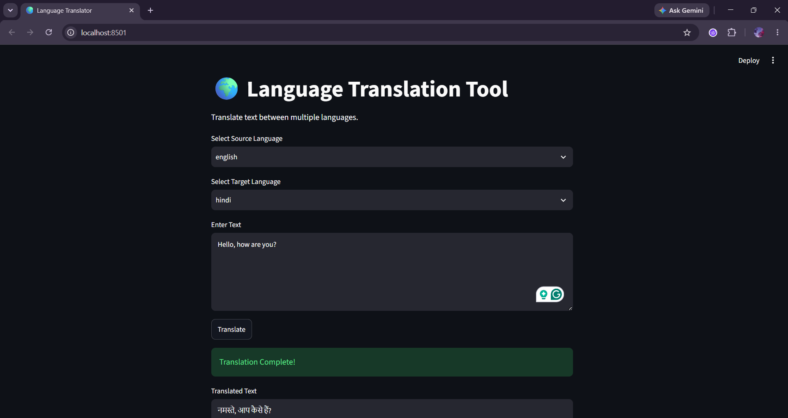

# 🌍 Language Translation Tool

A simple Language Translation Tool built using **Python**, **Streamlit**, and **deep-translator**.

---

## Features

- Translate text between multiple languages
- Select source language
- Select target language
- User-friendly interface built with Streamlit
- Uses Google Translator via deep-translator
- Displays translated text instantly

---

## Technologies Used

- Python
- Streamlit
- deep-translator

---

## Project Structure

```
CodeAlpha_Language_Translation_Tool/
│
├── app.py
├── requirements.txt
├── README.md
└── assets/
    └── Screenshot.png
```

---

## Screenshot



---

## Installation

Clone the repository:

```bash
git clone https://github.com/harshamohan23/Language_Translation_Tool.git
```

Install dependencies:

```bash
pip install -r requirements.txt
```

Run the application:

```bash
streamlit run app.py
```

---

## Learning Outcome

Through this project, I learned:

- Python fundamentals
- Streamlit UI development
- Classes and Objects
- Methods and Functions
- User Input Handling
- Conditional Statements
- API Integration
- Event-driven Programming

---

## Author

Harsha
